# 📚 Hướng dẫn hiểu toàn tập đồ án: Secure API Gateway with Cryptographic Enforcement

> **Dành cho ai?** Cho chính bạn — sinh viên năm 2, code phần lớn nhờ AI nên chưa hiểu hết.
> Tài liệu này giải thích **mọi thứ từ con số 0**: từ "API Gateway là gì" cho tới
> "dòng code này đang làm cái quái gì". Đọc xong bạn sẽ hiểu rõ và **tự code lại được**.
>
> **Cách đọc:** Đọc tuần tự từ Phần 1. Gặp từ lạ thì tra ở **Phần 2 — Từ điển thuật ngữ**.
> Mỗi đoạn code đều có giải thích "tiếng người" bên cạnh.

---

## 🗺️ Mục lục

1. [Đồ án này là cái gì? (giải thích như cho trẻ con)](#phần-1--đồ-án-này-là-cái-gì)
2. [Từ điển thuật ngữ — tra mọi từ lạ ở đây](#phần-2--từ-điển-thuật-ngữ)
3. [Lý thuyết nền tảng (mật mã, JWT, OAuth2, HMAC...)](#phần-3--lý-thuyết-nền-tảng)
4. [Kiến trúc tổng thể + sơ đồ](#phần-4--kiến-trúc-tổng-thể)
5. [Các "service" trong hệ thống (Docker)](#phần-5--các-service-trong-hệ-thống)
6. [Luồng chương trình chạy thế nào (từng bước)](#phần-6--luồng-chương-trình-chạy-thế-nào)
7. [Giải thích code từng file (deep-dive)](#phần-7--giải-thích-code-từng-file)
8. [Bộ kiểm thử bảo mật SEC-01 → SEC-10](#phần-8--bộ-kiểm-thử-bảo-mật)
9. [Observability — "nhìn thấy" hệ thống đang chạy](#phần-9--observability)
10. [Hướng dẫn tự triển khai lại từ đầu](#phần-10--tự-triển-khai-lại-từ-đầu)
11. [Câu hỏi thường gặp & mẹo demo](#phần-11--faq--mẹo)

---

## Phần 1 — Đồ án này là cái gì?

### 1.1. Một câu cho dễ nhớ

> Đồ án xây một **"chốt bảo vệ" đặt trước các API** (gọi là **API Gateway**). Mọi request
> muốn vào trong đều phải qua chốt này. Chốt sẽ dùng **mật mã** (cryptography) để kiểm tra:
> *"Mày là ai? Có đúng là mày không? Có phải tin nhắn này bị sửa giữa đường không? Mày có
> gửi đi gửi lại để phá không?"* — nếu không qua thì **chặn (trả lỗi 401)**.

### 1.2. Ví von đời thường

Hãy tưởng tượng một **toà nhà công ty** (= các API/dịch vụ bên trong). Trước cửa có một
**bảo vệ** (= API Gateway). Bảo vệ làm các việc:

| Việc của bảo vệ | Tương ứng trong đồ án |
|---|---|
| Soi **thẻ nhân viên** xem có thật không (có dấu nổi, hologram) | Kiểm tra **chữ ký số của JWT** |
| Từ chối thẻ giả người ngoài tự in | Chống **token giả (SEC-01)** |
| Với hàng hoá giao tới, kiểm tra **niêm phong** còn nguyên | **Ký HMAC** request service-to-service |
| Không cho 1 phiếu giao hàng dùng 2 lần | Chống **replay** bằng **nonce** |
| Thu hồi thẻ của nhân viên vừa bị đuổi việc | **Revoke token** (đẩy `jti` vào blacklist) |
| Không cho 1 người ra vào 1000 lần/phút (nghi phá hoại) | **Rate limit** |
| Ghi sổ ai vào ra lúc nào | **Logging / Metrics / Tracing** (observability) |

### 1.3. Đồ án bám theo chuẩn nào?

Bám **OWASP API Security Top 10 – 2023** (danh sách 10 lỗ hổng API phổ biến nhất do tổ
chức OWASP công bố). Đồ án tập trung chống 4 nhóm:

| Mối đe doạ (OWASP) | Cách đồ án chống |
|---|---|
| **API2 – Broken Authentication** (xác thực hỏng) | Verify chữ ký JWT qua JWKS, chặn `alg=none`, chặn token giả/sửa, thu hồi `jti` |
| **API2 – Toàn vẹn service-to-service** | **Ký HMAC-SHA256** từng request: chống replay (nonce) + chống tamper (sửa nội dung) |
| **API4 – Unrestricted Resource Consumption** | **Rate-limit** theo IP, trả mã `429` |
| **API8 – Security Misconfiguration** | Bí mật cất trong **Vault**, tách dev/prod, không lộ debug |

> 📌 **Ghi nhớ 2 "trụ cột" chính của đồ án:**
> 1. **JWT** → xác thực *con người / client* ("bạn là ai").
> 2. **HMAC** → bảo vệ *liên lạc máy-với-máy* ("tin nhắn này không bị sửa và không bị gửi lại").

---

## Phần 2 — Từ điển thuật ngữ

> Đây là phần **tra cứu**. Đọc lướt 1 lần, sau đó quay lại khi gặp từ lạ.

| Thuật ngữ | Nghĩa "tiếng người" |
|---|---|
| **API** | "Cửa" để 2 chương trình nói chuyện với nhau qua mạng. Ví dụ app điện thoại gọi API server để lấy dữ liệu. |
| **API Gateway** | Một server đứng **trước** tất cả API khác, làm "chốt kiểm soát" chung: xác thực, giới hạn, ghi log. |
| **Request / Response** | Request = lời yêu cầu client gửi đi. Response = câu trả lời server gửi về. |
| **HTTP status code** | Mã số trong response. `200` = OK, `401` = chưa xác thực/không hợp lệ, `429` = gửi quá nhiều, `400` = request sai. |
| **Endpoint** | Một "địa chỉ" cụ thể của API, ví dụ `/api/protected`. |
| **Middleware** | Lớp code chạy **xen giữa** lúc nhận request và lúc tới endpoint. Giống các trạm kiểm soát xếp hàng. |
| **Authentication (xác thực)** | Kiểm tra "**bạn là ai**". Như kiểm tra CMND. |
| **Authorization (uỷ quyền)** | Kiểm tra "**bạn được phép làm gì**". Như xem chức vụ. |
| **Token** | Một "tấm vé" số. Sau khi đăng nhập, server cấp token; lần sau đưa token là được vào, khỏi đăng nhập lại. |
| **Bearer token** | Kiểu gửi token qua header `Authorization: Bearer <token>`. "Bearer" = "ai cầm vé thì người đó được vào". |
| **JWT** (JSON Web Token) | Một loại token có 3 phần `header.payload.signature`, tự chứa thông tin + chữ ký chống giả. |
| **Claim** | Một mẩu thông tin trong payload của JWT, ví dụ `sub` (ai), `exp` (hết hạn lúc nào), `iss` (ai cấp). |
| **Signature (chữ ký số)** | Đoạn mã chứng minh token do đúng người tạo ra và **chưa bị sửa**. |
| **Cryptography (mật mã)** | Ngành toán học để giấu/bảo vệ thông tin: mã hoá, ký, băm. |
| **Hash (băm)** | Hàm biến dữ liệu bất kỳ thành 1 chuỗi cố định (vd SHA-256 → 64 ký tự hex). Đổi 1 bit dữ liệu → hash đổi hoàn toàn. Một chiều (không suy ngược ra dữ liệu gốc). |
| **HMAC** | "Hash có khoá bí mật". Dùng để chứng minh tin nhắn do người biết khoá tạo và không bị sửa. |
| **Symmetric (đối xứng)** | Mã hoá/ký dùng **1 khoá chung** cho cả 2 bên. Ví dụ HS256, HMAC. Nhanh nhưng phải chia sẻ bí mật. |
| **Asymmetric (bất đối xứng)** | Dùng **cặp khoá**: khoá riêng (private) để ký, khoá công khai (public) để verify. Ví dụ RS256, ES256. |
| **HS256 / RS256 / ES256** | 3 thuật toán ký JWT. HS256 = HMAC-SHA256 (đối xứng). RS256 = RSA. ES256 = ECDSA đường cong P-256 (bất đối xứng). |
| **ECDSA** | Chữ ký số dựa trên đường cong elliptic. Khoá ngắn, ký/verify nhanh, an toàn cao. |
| **JWKS** (JSON Web Key Set) | Danh sách **khoá công khai** mà IdP công bố để bên khác verify chữ ký token. |
| **kid** (Key ID) | Mã định danh 1 khoá trong JWKS, ghi trong header JWT để biết dùng khoá nào verify. |
| **IdP** (Identity Provider) | "Nhà cung cấp danh tính" — nơi quản lý tài khoản và **cấp token**. Ở đây là **Keycloak**. |
| **OAuth2 / OIDC** | Bộ quy tắc chuẩn để đăng nhập & cấp token an toàn. OIDC = OpenID Connect, xây trên OAuth2, thêm phần "bạn là ai". |
| **Flow** | Một "kịch bản" lấy token. VD: *Authorization Code + PKCE* (cho người dùng/web), *Client Credentials* (cho máy). |
| **PKCE** | Cơ chế chống đánh cắp mã code khi đăng nhập trên app/web công khai. |
| **Replay attack** | Hacker **bắt lại** 1 request hợp lệ rồi **gửi lại** để giả mạo. |
| **Nonce** | "Number used once" — chuỗi ngẫu nhiên **chỉ dùng 1 lần**, để chống replay. |
| **Tamper** | Hacker **sửa nội dung** request (vd đổi số tiền) nhưng giữ chữ ký cũ. |
| **Revocation (thu hồi)** | Vô hiệu hoá 1 token **trước khi nó hết hạn** (vd nhân viên nghỉ việc). |
| **jti** | "JWT ID" — mã định danh duy nhất của 1 token; dùng để revoke đúng token đó. |
| **Blacklist** | Danh sách đen các token (theo `jti`) đã bị thu hồi. |
| **Rate limit** | Giới hạn số request/khoảng thời gian để chống lạm dụng/DoS. |
| **Vault / KMS** | Kho cất **bí mật** (khoá, mật khẩu) an toàn. Vault = HashiCorp Vault. KMS = Key Management Service. |
| **Secret rotation** | Định kỳ **đổi khoá bí mật** để giảm rủi ro nếu khoá bị lộ. |
| **Redis** | Cơ sở dữ liệu trong RAM, cực nhanh, hợp để lưu thứ tạm có hạn dùng (nonce, blacklist, bộ đếm). |
| **TTL** (Time To Live) | "Thời gian sống" của 1 mục dữ liệu; hết TTL thì tự xoá. |
| **Observability** | Khả năng "nhìn thấy" hệ thống đang chạy ra sao, gồm **Logs + Metrics + Traces**. |
| **Prometheus / Grafana** | Prometheus thu thập **số liệu (metrics)**; Grafana **vẽ biểu đồ** từ số liệu đó. |
| **Jaeger / OpenTelemetry** | OpenTelemetry (OTel) tạo **trace** (dấu vết 1 request đi qua đâu, lâu bao nhiêu); Jaeger hiển thị trace. |
| **Docker / Docker Compose** | Docker đóng gói mỗi service vào "container" chạy giống nhau ở mọi máy. Compose chạy nhiều container cùng lúc. |
| **FastAPI** | Framework Python để viết web API nhanh gọn. Đồ án dùng nó viết Gateway. |
| **Constant-time compare** | So sánh 2 chuỗi mà **thời gian luôn bằng nhau** dù đúng/sai, chống "timing attack" (đoán bí mật qua thời gian phản hồi). |
| **Canonical request** | "Bản chuẩn hoá" của request — dựng theo công thức cố định để 2 bên ký/verify ra cùng kết quả. |
| **401 / fail-closed** | Khi nghi ngờ thì **từ chối** (đóng cửa), an toàn hơn là cho qua (fail-open). |

---

## Phần 3 — Lý thuyết nền tảng

> Phần này dạy bạn **kiến thức mật mã & xác thực** vừa đủ để hiểu code. Không cần biết
> toán nặng — chỉ cần hiểu "nó làm gì và tại sao".

### 3.1. Băm (Hash) — viên gạch nền

**Hàm băm** (vd SHA-256) nhận dữ liệu bất kỳ và cho ra 1 "dấu vân tay" cố định:

```
SHA-256("hello")      = 2cf24dba5fb0a30e26e83b2ac5b9e29e1b161e5c1fa7425e73043362938b9824
SHA-256("hellp")      = 7a38bf81... (đổi 1 chữ -> khác hoàn toàn)
SHA-256("")           = e3b0c44298fc1c149afbf4c8996fb92427ae41e4649b934ca495991b7852b855
```

Tính chất quan trọng:
- **Cố định độ dài:** input dài ngắn gì, output luôn 64 ký tự hex (256 bit).
- **Một chiều:** từ hash không suy ngược ra dữ liệu gốc.
- **Nhạy cảm:** đổi 1 bit → hash đổi hoàn toàn → phát hiện được "có ai sửa không".

> 💡 Chuỗi `e3b0c442...b855` xuất hiện trong code (`EMPTY_BODY_HASH`) chính là **SHA-256 của
> chuỗi rỗng**. Khi request không có body, ta dùng sẵn hash này.

### 3.2. Đối xứng vs Bất đối xứng

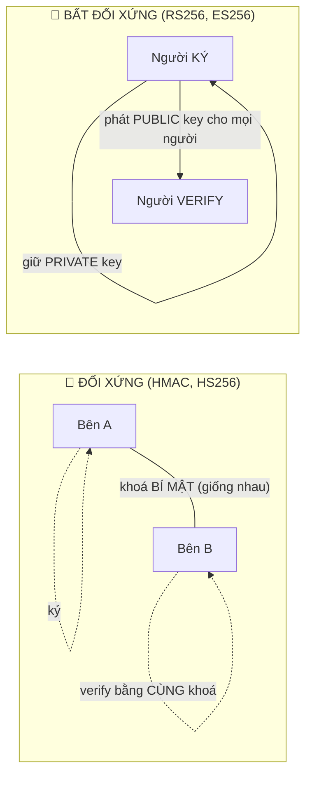

| | Đối xứng (HS256/HMAC) | Bất đối xứng (RS256/ES256) |
|---|---|---|
| Khoá | **1 khoá chung** cả 2 bên | **Cặp khoá**: private (ký) + public (verify) |
| Ưu | Rất nhanh, đơn giản | Không phải chia sẻ bí mật; ai cũng verify được bằng public key |
| Nhược | Phải chia sẻ bí mật an toàn; lộ khoá là toang cả ký lẫn verify | Chậm hơn chút khi ký |
| Dùng khi | Máy-với-máy, 2 bên tin nhau | Token phát cho **nhiều bên** verify (như Keycloak → Gateway) |

> **Vì sao đồ án ưu tiên ES256 cho JWT?** Vì Keycloak (bên cấp token) chỉ cần giữ private
> key; Gateway và mọi service khác chỉ cần **public key** (lấy qua JWKS) để verify. Không
> ai phải cầm bí mật ký → an toàn hơn nhiều so với HS256 (nơi ai có khoá đều ký được token giả).

### 3.3. HMAC — "chữ ký bằng khoá chung"

**HMAC-SHA256(khoá_bí_mật, dữ_liệu)** = một chuỗi 64 ký tự. Ai biết `khoá_bí_mật` thì:
- **Tạo được** HMAC giống hệt → chứng minh "tao là người biết khoá".
- **Phát hiện** nếu `dữ_liệu` bị sửa (vì HMAC sẽ khác).

Đồ án dùng HMAC để ký **mỗi request máy-với-máy** tới `/api/service`. Như niêm phong bưu kiện.

### 3.4. JWT — cấu trúc 3 phần

JWT là chuỗi dạng `xxxxx.yyyyy.zzzzz`, ngăn bởi dấu chấm:

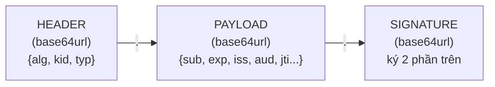

- **Header:** ghi thuật toán (`alg`, vd ES256) và `kid` (dùng khoá nào).
- **Payload:** các **claim** = thông tin: `sub` (ai), `iss` (ai cấp), `aud` (cấp cho dịch vụ nào), `exp` (hết hạn), `iat` (cấp lúc nào), `jti` (mã token).
- **Signature:** chữ ký của `header.payload`, để chống giả/sửa.

> ⚠️ **Cực kỳ quan trọng:** Header & Payload chỉ là **base64url — KHÔNG mã hoá**, ai cũng
> đọc được (dán vào jwt.io là thấy hết). Cái bảo vệ JWT là **chữ ký**, không phải sự bí mật.
> Vì vậy **không bao giờ để mật khẩu/bí mật trong payload**.

#### Các kiểu tấn công JWT mà đồ án chống:

| Tấn công | Giải thích | Cách chống trong code |
|---|---|---|
| **Token giả** (SEC-01) | Hacker tự tạo token, ký bằng khoá của hắn | Verify chữ ký bằng **public key thật từ JWKS** → chữ ký hacker không khớp |
| **alg=none** (SEC-02) | Hacker đổi header thành `alg:none` để "bỏ chữ ký" | **Whitelist** chỉ chấp nhận HS256/RS256/ES256 |
| **HS256 khoá yếu** (SEC-03) | Nếu dùng HS256 với khoá ngắn, hacker brute-force ra khoá | Bắt khoá ≥ 32 byte, ưu tiên ES256 |
| **Token hết hạn** (SEC-04) | Dùng token đã quá `exp` | Bật `verify_exp` |
| **Sai aud/iss** (SEC-05/06) | Token của hệ khác đem dùng | Bật `verify_aud`, `verify_iss` |
| **Token đã thu hồi** (SEC-10) | Token vẫn còn hạn nhưng đã bị revoke | Check `jti` trong **blacklist Redis** |

### 3.5. OAuth2 / OpenID Connect & các "flow"

**OAuth2** là chuẩn để **cấp quyền truy cập** mà không cần đưa mật khẩu cho bên thứ ba.
**OIDC** thêm phần "xác thực danh tính" (id_token). Trong đồ án, **Keycloak** đóng vai IdP.

Đồ án dùng 2 flow:

**a) Client Credentials** (máy-với-máy, không có người dùng):
```
Service  --(client_id + client_secret)-->  Keycloak  --(access_token JWT)-->  Service
```
Đây là cách `scripts/demo.py` lấy token tự động.

**b) Authorization Code + PKCE** (có người dùng đăng nhập qua trình duyệt):

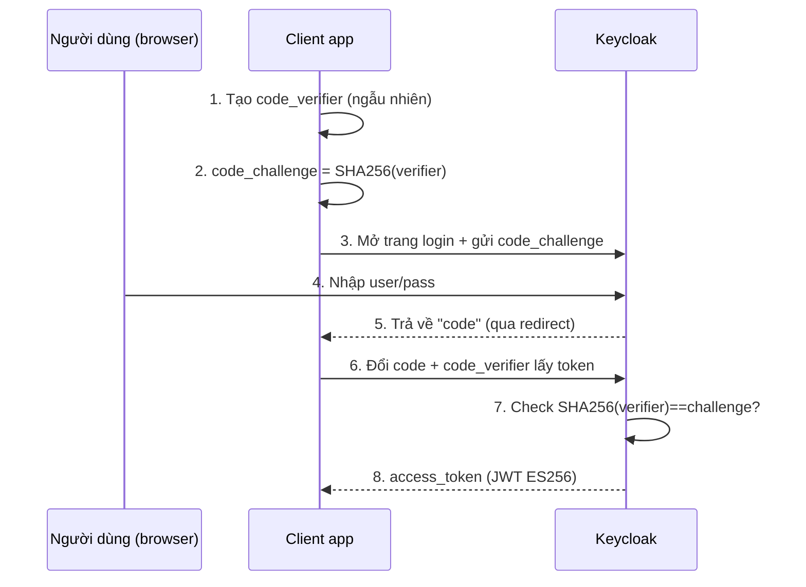

**PKCE giải quyết gì?** Trên web/mobile không giữ được bí mật, hacker có thể chặn lấy `code`.
PKCE bắt client chứng minh "tao chính là đứa khởi tạo" bằng `code_verifier` mà chỉ nó biết.
→ Xem code thật ở `clients/pkce_flow.py` (giải thích ở Phần 7).

### 3.6. Replay & Nonce (cho HMAC)

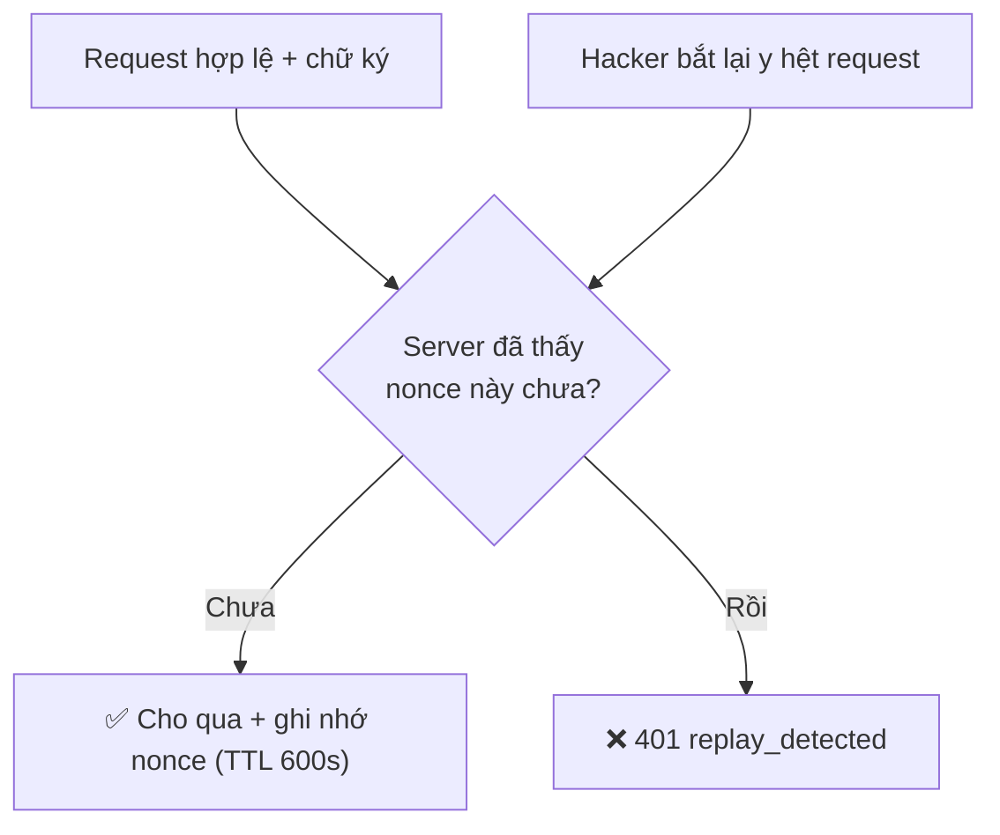

- **Nonce** = UUID ngẫu nhiên dùng 1 lần. Server lưu vào Redis sau khi dùng.
- **Timestamp window 300s:** request cũ hơn 5 phút bị từ chối → hacker không thể để dành request cũ.
- Kết hợp 2 cái: replay gần như bất khả thi.

### 3.7. Vault & Secret Rotation

Không bao giờ "hardcode" bí mật vào code (ai xem source là thấy). Thay vào đó cất ở **Vault**.
Gateway hỏi Vault lúc chạy để lấy khoá HMAC / secret HS256. **Rotation** = đổi khoá định kỳ;
nhờ `kid` trong JWT, có thể chạy song song khoá cũ + mới trong giai đoạn chuyển tiếp.

---

## Phần 4 — Kiến trúc tổng thể

> Xem file sơ đồ nguồn: [`so-do/01-kien-truc-tong-the.mmd`](so-do/01-kien-truc-tong-the.mmd)

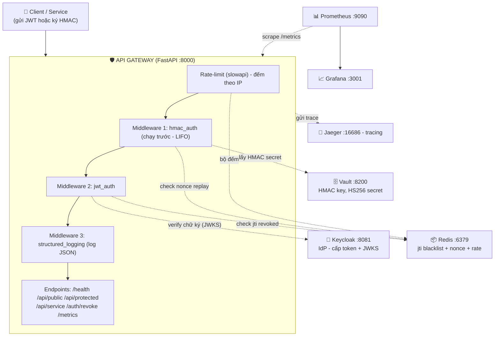

**Ý tưởng cốt lõi:** Gateway là **trung tâm**. Nó không tự lưu gì lâu dài — nó **hỏi** các
service vệ tinh: Keycloak (khoá để verify), Redis (nhớ nonce/blacklist/bộ đếm), Vault (bí mật).
Còn Prometheus/Jaeger/Grafana là "camera giám sát".

---

## Phần 5 — Các service trong hệ thống

Tất cả định nghĩa trong [`infra/docker-compose.yml`](../../infra/docker-compose.yml). Mỗi
"service" là 1 container Docker chạy độc lập, nói chuyện qua mạng nội bộ `gw-net`.

| Service | Cổng | Vai trò (giải thích) |
|---|---|---|
| **gateway** | 8000 | Chính nó — app FastAPI bạn viết. Build từ `gateway/Dockerfile`. |
| **keycloak** | 8081→8080 | IdP: nơi cấp token JWT và công bố JWKS. Tự nạp realm `nt219` từ `idp-config/`. |
| **redis** | 6379 | Bộ nhớ nhanh: lưu nonce (chống replay), `jti` blacklist (revoke), bộ đếm rate-limit. |
| **vault** | 8200 | Kho bí mật (chạy *dev mode*). Giữ khoá HMAC và secret HS256. |
| **vault-seed** | — | Container "chạy 1 lần rồi thoát": nạp sẵn các secret vào Vault. Thấy nó **Exited 0** là **đúng**. |
| **prometheus** | 9090 | Cứ vài giây lại "cào" (`scrape`) endpoint `/metrics` của Gateway để lấy số liệu. |
| **jaeger** | 16686 | Nhận & hiển thị trace (đường đi của request). Cổng 4318 nhận dữ liệu OTLP. |
| **grafana** | 3001→3000 | Vẽ dashboard từ số liệu Prometheus. Login admin/admin. |

> **Lưu ý map cổng** `8081:8080` nghĩa là: bên ngoài (máy bạn) gõ `8081`, bên trong container
> là `8080`. Đó là lý do `ISSUER` token là `localhost:8081` nhưng Gateway gọi nội bộ qua `keycloak:8080`.

Phần seed Vault (trong docker-compose) nạp 3 bí mật:
```bash
vault kv put secret/gateway/hmac/dev-key-01  value="dev-shared-secret"
vault kv put secret/gateway/hmac/prod-key-01 value="prod-shared-secret-32bytes-min!!"
vault kv put secret/gateway/hs256            value="hs256-realm-shared-secret-32b!!"
```
→ Khi Gateway cần secret cho `X-Key-Id: dev-key-01`, nó đọc path `gateway/hmac/dev-key-01`.

---

## Phần 6 — Luồng chương trình chạy thế nào

### 6.1. Thứ tự middleware (điều dễ nhầm nhất!)

Trong `gateway/main.py`:
```python
app.middleware("http")(hmac_auth_middleware)   # đăng ký SAU
app.middleware("http")(jwt_auth_middleware)    # đăng ký SAU NỮA
```

FastAPI/Starlette chạy middleware theo kiểu **LIFO** (Last In, First Out) — *cái đăng ký
sau lại chạy trước*. Cộng thêm `structured_logging` (đăng ký bằng decorator phía trên) và
rate-limit. Thứ tự **thực tế khi 1 request đi vào**:

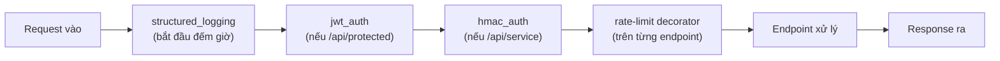

> Mỗi middleware **tự kiểm tra path**: `jwt_auth` chỉ ra tay khi path bắt đầu `/api/protected`;
> `hmac_auth` chỉ ra tay khi path bắt đầu `/api/service`. Path khác thì nó cho đi thẳng qua.

### 6.2. Luồng JWT (vào `/api/protected`)

> Sơ đồ nguồn: [`so-do/02-luong-jwt.mmd`](so-do/02-luong-jwt.mmd)

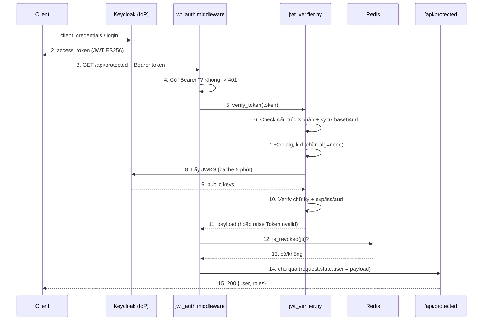

### 6.3. Luồng HMAC (vào `/api/service`)

> Sơ đồ nguồn: [`so-do/03-luong-hmac.mmd`](so-do/03-luong-hmac.mmd)

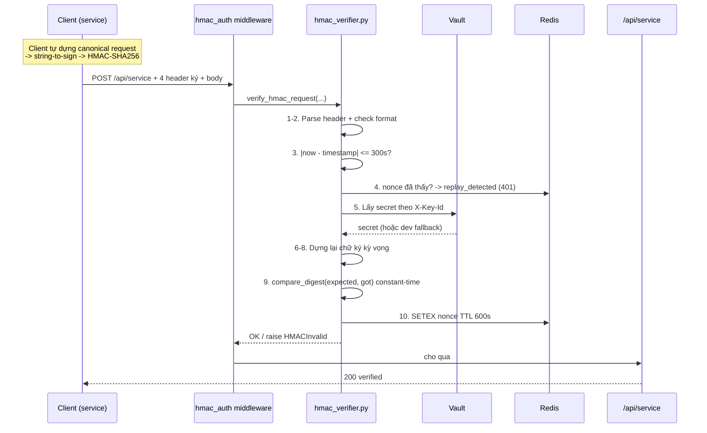

### 6.4. Luồng Revoke (thu hồi token)

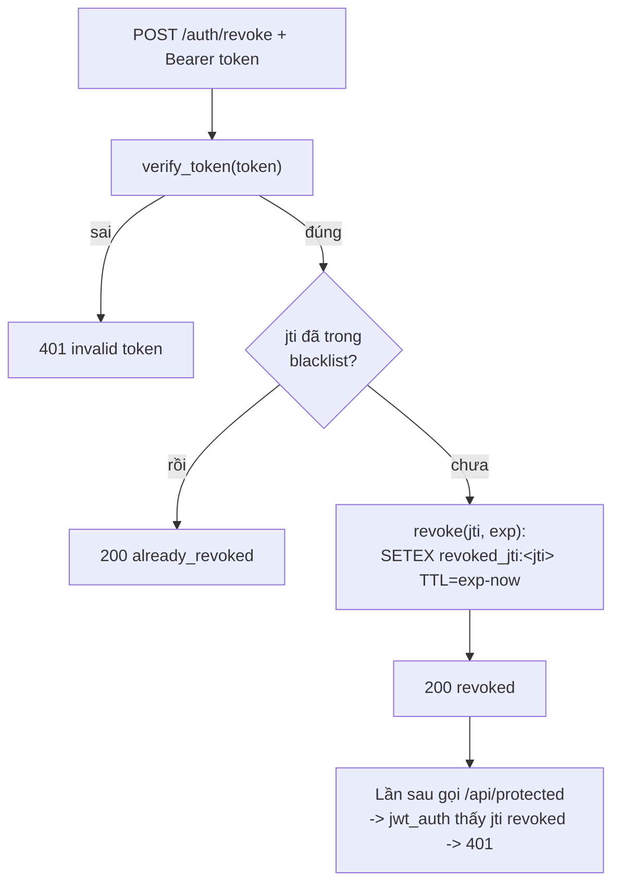

TTL của blacklist đặt bằng `exp - now` — tức **chỉ cần nhớ tới lúc token tự hết hạn**, sau
đó Redis tự xoá (token hết hạn thì sao cũng bị chặn rồi, khỏi nhớ nữa). Rất tiết kiệm.

---

## Phần 7 — Giải thích code từng file

> Đây là phần "mổ xẻ" — đọc kèm file thật. Mỗi đoạn có giải thích "đang làm gì & tại sao".

### 7.1. `gateway/main.py` — điểm khởi động & lắp ráp

```python
app = FastAPI(title="Secure API Gateway")
app.include_router(auth_router)          # gắn route /auth/revoke
setup_rate_limit(app)                    # bật rate-limit
Instrumentator().instrument(app).expose(app, endpoint="/metrics", ...)  # bật /metrics
setup_tracing(app)                       # bật tracing (tự tắt nếu không có Jaeger)
```
- **`FastAPI(...)`**: tạo ứng dụng web.
- **`include_router`**: gắn nhóm endpoint định nghĩa ở file khác (`routes/auth.py`).
- **`Instrumentator()`**: thư viện tự tạo endpoint `/metrics` cho Prometheus đọc.

Middleware ghi log (định nghĩa bằng `@app.middleware("http")`):
```python
async def structured_logging_middleware(request, call_next):
    start_time = time.time()
    response = await call_next(request)          # đẩy request vào sâu hơn
    process_time_ms = round((time.time()-start_time)*1000, 2)  # đo độ trễ
    gateway_logger.info("API Traffic", extra={...method, path, status, ip, latency...})
    return response
```
> `call_next` = "gọi lớp tiếp theo". Trước `call_next` là lúc *request đi vào*; sau `call_next`
> là lúc *response đi ra*. Nên đo giờ ở đây là đo trọn vòng đời request.

Đăng ký 2 auth middleware (nhớ LIFO ở Phần 6.1):
```python
app.middleware("http")(hmac_auth_middleware)
app.middleware("http")(jwt_auth_middleware)
```

Các endpoint:
```python
@app.get("/health")                  # không bảo vệ — để check sống/chết
@app.get("/api/public")
@limiter.limit("10/minute")          # rate-limit 10 req/phút
@app.get("/api/protected")
@limiter.limit("5/minute")           # cần JWT (middleware lo), 5 req/phút
@app.post("/api/service")
@limiter.limit("100/minute")         # cần HMAC, 100 req/phút (M2M gọi nhiều)
```
> `@limiter.limit(...)` là **decorator** — "dán" thêm hành vi giới hạn lên hàm. Vì vậy hàm
> endpoint **bắt buộc** có tham số `request: Request` để slowapi đọc IP.

### 7.2. `gateway/crypto/jwt_verifier.py` — trái tim xác thực JWT

Đây là file **quan trọng nhất** về bảo mật. Đọc kỹ.

**(a) Cache JWKS để khỏi gọi Keycloak liên tục:**
```python
_jwks_cache = TTLCache(maxsize=1, ttl=300)   # nhớ JWKS trong 5 phút
def _get_jwks():
    if "jwks" in _jwks_cache: return _jwks_cache["jwks"]
    resp = httpx.get(JWKS_URL, timeout=5.0); resp.raise_for_status()
    _jwks_cache["jwks"] = resp.json()
    return _jwks_cache["jwks"]
```
> Mỗi lần verify token bất đối xứng cần public key. Nếu lần nào cũng gọi Keycloak thì chậm
> và phụ thuộc mạng. `TTLCache` giữ kết quả 300 giây rồi mới lấy lại.

**(b) Phòng thủ cấu trúc trước khi tin token (chống ký tự lạ, padding):**
```python
if not token or len(token.split('.')) != 3:
    raise TokenInvalid("Malformed token structure...")     # JWT phải có đúng 3 phần
for part in token.split('.'):
    if '=' in part: raise TokenInvalid("...padding...")     # base64url chuẩn không có '='
    if not all(c in "A-Za-z0-9-_" for c in part): raise ... # chỉ cho ký tự base64url
```
> Đây là "kiểm tra vệ sinh đầu vào" — loại bỏ token dị dạng *trước khi* đưa vào thư viện,
> giảm bề mặt tấn công (vd "base64 malleability").

**(c) Chặn `alg=none` và whitelist thuật toán (SEC-02):**
```python
unverified_header = jwt.get_unverified_header(token)   # đọc header (chưa verify)
alg = unverified_header.get("alg")
kid = unverified_header.get("kid")
if alg not in ("HS256", "RS256", "ES256"):
    raise TokenInvalid(f"...Algorithm '{alg}' is blacklisted")
```
> Tấn công kinh điển: hacker sửa header thành `"alg":"none"` để token "không cần chữ ký".
> Whitelist này khiến mọi alg ngoài 3 cái được phép đều bị từ chối ngay.

**(d) Bật mọi kiểm tra nghiêm ngặt:**
```python
decode_options = {
    "verify_signature": True,  # phải đúng chữ ký
    "verify_exp": True,        # phải còn hạn (SEC-04)
    "verify_iss": True,        # đúng nơi cấp (SEC-06)
    "verify_aud": True,        # đúng đối tượng (SEC-05)
    "require": ["exp","iat","iss","aud"]   # thiếu claim là loại (SEC liên quan)
}
```

**(e) Xác thực theo từng thuật toán:**
```python
if alg == "HS256":                                   # đối xứng
    secret = os.getenv("HS256_SECRET") or "hs256-realm-shared-secret-32b!!"
    return jwt.decode(token, secret, algorithms=["HS256"], audience=AUDIENCE,
                      issuer=ISSUER, options=decode_options)
elif alg in ("RS256", "ES256"):                      # bất đối xứng
    if not kid: raise TokenInvalid("...Missing kid...")
    jwks = _get_jwks()
    key = next((k for k in jwks["keys"] if k["kid"] == kid), None)  # tìm đúng khoá theo kid
    if not key: raise TokenInvalid(f"...Key ID '{kid}' not registered...")
    return jwt.decode(token, key, algorithms=[alg], audience=AUDIENCE,
                      issuer=ISSUER, options=decode_options)
```
> - HS256: lấy secret từ biến môi trường (do Vault/infra set), **không hardcode**. Có fallback
>   dev cho tiện chạy local.
> - ES256/RS256: lấy đúng public key trong JWKS theo `kid`. **Đây là cách chống token giả
>   (SEC-01)**: chữ ký do hacker tạo sẽ không khớp public key thật.

**(f) Đóng gói lỗi an toàn:**
```python
except JWTError as e:
    raise TokenInvalid(f"Token verification rejected: {str(e)}")
```
> Bắt mọi lỗi thư viện và bọc lại thành `TokenInvalid` để tầng trên trả 401 thống nhất,
> không lộ chi tiết nội bộ.

### 7.3. `gateway/crypto/hmac_verifier.py` — ký & verify request M2M

**Hằng số & quy ước (khớp 100% với `docs/hmac-signing-spec.md`):**
```python
ALGORITHM = "HMAC-SHA256"
SCOPE = "gateway-internal/v1"
TIMESTAMP_WINDOW = 300       # request lệch quá 300s -> loại
NONCE_TTL = 600             # nhớ nonce 600s (> window, để chắc ăn)
EMPTY_BODY_HASH = "e3b0c442...b855"   # SHA-256 của body rỗng
```

**Dựng "canonical request" — bản chuẩn hoá để 2 bên ký ra giống nhau:**
```python
def _build_canonical_request(method, path, query, signed_headers_values, body):
    sorted_keys = sorted(signed_headers_values.keys())   # sắp xếp để ổn định
    canonical_headers = "".join(f"{k}:{v.strip()}\n" for k in sorted_keys ...)
    signed_headers = ";".join(sorted_keys)               # host;x-key-id;x-nonce;x-timestamp
    body_hash = sha256(body).hexdigest() if body else EMPTY_BODY_HASH
    return method.upper()+"\n"+path+"\n"+query+"\n"+canonical_headers+"\n"+signed_headers+"\n"+body_hash
```
> **Vì sao phải chuẩn hoá?** Vì client và server phải ký **đúng cùng một chuỗi** thì chữ ký
> mới khớp. Quy tắc: viết hoa method, sắp xếp header theo alphabet, hash body... → ai làm
> đúng quy tắc cũng ra cùng kết quả. **Hash body vào đây chính là cách chống tamper (SEC-09)**:
> đổi body → body_hash đổi → chữ ký đổi → bị từ chối.

**String-to-sign rồi tính chữ ký:**
```python
def _build_string_to_sign(ts, canonical_request):
    return f"{ALGORITHM}\n{ts}\n{SCOPE}\n{sha256(canonical_request).hexdigest()}"

def compute_signature(method, path, query, signed_headers_values, body, secret):
    canonical = _build_canonical_request(...)
    sts = _build_string_to_sign(signed_headers_values["x-timestamp"], canonical)
    return hmac.new(secret, sts.encode(), hashlib.sha256).hexdigest()
```
> `compute_signature` là **pure function** (chỉ tính toán, không phụ thuộc trạng thái ngoài),
> nên **cả client lẫn server đều dùng chung** → chắc chắn khớp. Client demo (`test_hmac.py`,
> `demo.py`) import đúng hàm này để ký.

**Verify theo đúng 10 bước trong spec:**
```python
def verify_hmac_request(method, path, query, headers, body, nonce_store):
    h = {k.lower(): v for k, v in headers.items()}
    # 1. lấy 4 header (thiếu -> missing_header)
    ts, nonce, key_id, signature = h["x-timestamp"], h["x-nonce"], h["x-key-id"], h["x-signature"]
    # 2. check format: ts là số, nonce là UUIDv4, signature là hex 64
    # 3. cửa sổ thời gian: abs(now - ts) > 300 -> invalid_timestamp   (SEC-08)
    # 4. nonce đã có trong Redis? -> replay_detected                   (SEC-07)
    # 5. secret = _resolve_secret(key_id)  (Vault -> dev fallback); None -> unknown_key
    # 6-8. expected = compute_signature(...)  dựng lại chữ ký
    # 9. hmac.compare_digest(expected, signature)  -> sai = invalid_signature
    # 10. nonce_store.setex(nonce_key, 600, "1")   đánh dấu đã dùng
```

**Constant-time compare (chống timing attack):**
```python
if not hmac.compare_digest(expected, signature):
    raise HMACInvalid("invalid_signature")
```
> Nếu so sánh bằng `==` thường, thời gian phản hồi khác nhau tuỳ chữ ký đúng tới ký tự thứ
> mấy → hacker đoán dần được. `compare_digest` luôn mất thời gian như nhau.

**Lấy secret — ưu tiên Vault, có fallback dev:**
```python
def _resolve_secret(key_id):
    try:
        from gateway.storage.vault_client import get_secret, VaultError
        path = _VAULT_PATH_TEMPLATE.format(key_id=key_id)  # gateway/hmac/<key_id>
        try: return get_secret(path, field="value").encode()
        except VaultError:
            if _REQUIRE_VAULT: return None        # production: fail-closed
    except ImportError:
        if _REQUIRE_VAULT: return None
    return _DEV_SECRETS.get(key_id)               # dev fallback
```
> Bật `HMAC_REQUIRE_VAULT=1` ở production → nếu Vault hỏng thì **từ chối** (không dùng dev key).
> Đây là tư duy **fail-closed**.

### 7.4. `gateway/middleware/auth.py` — middleware JWT

```python
async def jwt_auth_middleware(request, call_next):
    if request.url.path.startswith("/api/protected"):     # chỉ bảo vệ path này
        auth = request.headers.get("authorization", "")
        if not auth.startswith("Bearer "):
            record_failure("jwt", "missing_bearer"); return 401
        try:
            payload = verify_token(auth[7:])              # bỏ "Bearer " (7 ký tự)
        except TokenInvalid:
            record_failure("jwt", "invalid_token"); return 401
        jti = payload.get("jti")
        if jti and is_revoked(jti):                       # SEC-10
            record_failure("jwt", "token_revoked"); return 401
        record_success("jwt")
        request.state.user = payload                      # nhét payload để endpoint dùng
    return await call_next(request)
```
> - `auth[7:]` cắt bỏ chữ `"Bearer "`. - Mỗi nhánh lỗi đều `record_failure(...)` để **đếm
>   metric** + `annotate_auth_span(...)` để **gắn nhãn vào trace**. - Nếu qua hết thì gắn
>   `request.state.user` để hàm `/api/protected` lấy ra username/roles.

### 7.5. `gateway/middleware/hmac_auth.py` — middleware HMAC

```python
redis_client = redis.Redis(host=..., port=..., decode_responses=True)   # nonce store

async def hmac_auth_middleware(request, call_next):
    if not request.url.path.startswith("/api/service"):
        return await call_next(request)          # path khác -> đi thẳng
    body = await request.body()                  # đọc raw body (cần để hash)
    try:
        verify_hmac_request(method=..., path=..., query=..., headers=dict(request.headers),
                            body=body, nonce_store=redis_client)
    except HMACInvalid as e:
        reason = str(e).split(":")[0]            # lấy mã lỗi gọn cho metric
        record_failure("hmac", reason); return 401
    record_success("hmac")
    return await call_next(request)
```
> Middleware này chỉ là "lớp vỏ web": nó lấy body/headers từ HTTP rồi **giao toàn bộ logic
> mật mã cho `hmac_verifier`**. Tách bạch như vậy giúp test logic ký mà không cần chạy web.

### 7.6. `gateway/middleware/rate_limit.py` — giới hạn tần suất

```python
limiter = Limiter(key_func=get_remote_address,    # định danh theo IP
                  storage_uri=REDIS_URL,           # đếm trong Redis (chia sẻ giữa nhiều bản)
                  strategy="fixed-window")
def setup_rate_limit(app):
    app.state.limiter = limiter
    app.add_exception_handler(RateLimitExceeded, _rate_limit_exceeded_handler)  # vượt -> 429
```
> Dùng Redis làm nơi đếm để nếu chạy **nhiều bản Gateway** thì bộ đếm vẫn chung. "fixed-window"
> = đếm theo cửa sổ thời gian cố định (vd mỗi phút reset).

### 7.7. `gateway/storage/revocation.py` — blacklist token

```python
PREFIX = "revoked_jti:"
def revoke(jti, exp):
    ttl = max(1, int(exp) - int(time.time()))     # nhớ tới khi token hết hạn
    _get_client().setex(PREFIX + jti, ttl, "1")
    return ttl
def is_revoked(jti):
    if not jti: return False
    return _get_client().exists(PREFIX + jti) == 1
```
> `set_client()` cho phép **test** thay Redis thật bằng đồ giả (xem SEC-10 ở test).

### 7.8. `gateway/storage/vault_client.py` — đọc bí mật từ Vault

```python
def get_secret(path, field="value"):
    cache_key = f"{path}::{field}"
    if cache_key in _cache: return _cache[cache_key]      # cache 5 phút
    resp = httpx.get(_kv_url(path), headers={"X-Vault-Token": VAULT_TOKEN}, timeout=3.0)
    resp.raise_for_status()
    data = resp.json()["data"]["data"]                     # KV-v2 lồng "data" 2 lớp
    ...
    return data[field]
```
> Vault KV-v2 trả JSON lồng `data.data`. Có **cache** để giảm số lần gọi Vault (giảm overhead —
> đúng tinh thần RQ2 trong đề bài). `clear_cache()` để rotation/test ép lấy lại.

### 7.9. `gateway/routes/auth.py` — endpoint revoke

```python
@router.post("/revoke")
def revoke_token(authorization: str | None = Header(None)):
    if not authorization or not authorization.startswith("Bearer "): raise 401
    payload = verify_token(authorization[7:])        # phải là token hợp lệ mới revoke được
    jti, exp = payload.get("jti"), payload.get("exp")
    if not jti or not exp: raise 400
    if is_revoked(jti): return {"status":"already_revoked", ...}   # idempotent
    ttl = revoke(jti, exp)
    return {"status":"revoked", "jti":jti, "ttl":ttl}
```
> "Idempotent" = gọi nhiều lần cũng an toàn, lần 2 trả `already_revoked` chứ không lỗi.

### 7.10. `gateway/observability/*` — log, metric, trace

- **`logger.py`**: định nghĩa `JSONFormatter` để mỗi dòng log là 1 object JSON (máy đọc được,
  dễ đẩy vào hệ thống log tập trung). `propagate=False` để không in trùng.
- **`metrics.py`**: 2 bộ đếm Prometheus — `auth_failures_total{method,reason}` và
  `auth_success_total{method}`. Hàm `record_failure/record_success` để middleware gọi.
- **`tracing.py`**: cấu hình OpenTelemetry gửi trace sang Jaeger. **Thiết kế an toàn**: nếu
  chưa cài OTel hoặc đặt `OTEL_SDK_DISABLED=true` thì mọi hàm thành **no-op** (không làm gì),
  Gateway vẫn chạy. `annotate_auth_span(...)` gắn thuộc tính `auth.method/result/user_id/latency_ms`
  lên span để soi trên Jaeger.

### 7.11. `clients/pkce_flow.py` & `clients/test_hmac.py`

- **`pkce_flow.py`**: minh hoạ flow Authorization Code + PKCE *có người dùng thật*. Tạo
  `verifier` ngẫu nhiên → `challenge = base64url(SHA256(verifier))` → mở trình duyệt đăng nhập
  → nhận `code` → đổi `code + verifier` lấy token ES256. Dùng để **chứng minh OIDC hoạt động**.
- **`test_hmac.py`**: demo ký HMAC đúng spec 3 pha (hợp lệ → replay → tamper). Quan trọng:
  nó **import `compute_signature` từ chính Gateway** nên chữ ký luôn khớp.

### 7.12. `scripts/demo.py` — "đạo diễn" demo 7 cảnh

File này tự động: lấy token thật từ Keycloak (client_credentials) rồi diễn 7 cảnh, mỗi bước
in `[PASS]/[FAIL]`. Đây là cách nhanh nhất để **chứng minh toàn bộ tính năng** khi present.
Đọc bảng cảnh ở README mục 5. Hàm `make_alg_none()` trong file tự chế 1 token `alg=none` để
tấn công thử (và phải bị chặn).

---

## Phần 8 — Bộ kiểm thử bảo mật

Đây là phần "tự chứng minh hệ thống an toàn". Mỗi kịch bản tấn công có 1 test pytest (chạy
**offline**, không cần stack) trong `tests/security/`.

| ID | Tấn công | Phòng thủ | Test |
|---|---|---|---|
| SEC-01 | Token giả ký bằng key lạ | verify chữ ký qua JWKS | `test_sec01_forgery_wrong_key` |
| SEC-02 | `alg=none` downgrade | whitelist thuật toán | `test_sec02_alg_none_downgrade` |
| SEC-03 | Brute-force HS256 khoá yếu | bắt khoá ≥32 byte, ưu tiên ES256 | `sec03_weak_hs256_demo.py` |
| SEC-04 | Token hết hạn | kiểm `exp` | `test_sec04_expired_token` |
| SEC-05 | Sai `aud` | kiểm claim | `test_sec05_wrong_audience` |
| SEC-06 | Sai `iss` | kiểm claim | `test_sec06_wrong_issuer` |
| SEC-07 | Replay request HMAC | nonce 1 lần (Redis 600s) | `test_hmac_attacks.py` |
| SEC-08 | Timestamp ngoài cửa sổ | window 300s | `test_hmac_attacks.py` |
| SEC-09 | Tamper body giữ chữ ký | hash body vào canonical | `test_hmac_attacks.py` |
| SEC-10 | Dùng token đã revoke | `jti` blacklist | `test_sec10_revoked_jti` |

**Đọc 1 test mẫu** (`test_jwt_attacks.py`):
```python
def test_sec02_alg_none_downgrade(client):
    r = client.get(PROTECTED, headers=_auth(make_alg_none_token()))
    assert r.status_code == 401          # alg=none PHẢI bị chặn
```
**SEC-10 thông minh ở chỗ** dùng 1 store giả `_RevokedStore`:
```python
class _RevokedStore:          # giả lập Redis: coi mọi jti trong set là đã thu hồi
    def exists(self, name): return 1 if name.removeprefix(PREFIX) in self.revoked else 0
def test_sec10_revoked_jti(client):
    tok = make_token(extra={"jti": "revoked-token-xyz"})
    assert client.get(PROTECTED, headers=_auth(tok)).status_code == 200   # trước revoke: OK
    _revocation.set_client(_RevokedStore({"revoked-token-xyz"}))          # tiêm store giả
    assert client.get(PROTECTED, headers=_auth(tok)).status_code == 401   # sau revoke: chặn
```
> Đây là kỹ thuật **dependency injection / monkeypatch**: thay Redis thật bằng đồ giả để test
> không cần Redis. `conftest.py` lo việc tạo `client` test và tắt OTel.

**Chạy test:**
```bash
pytest tests/security -v                          # toàn bộ SEC-01..10
python -m tests.security.sec03_weak_hs256_demo    # demo brute-force HS256 yếu
python clients/test_hmac.py                        # demo ký/replay/tamper (cần stack)
```

---

## Phần 9 — Observability

"Observability" = 3 trụ cột giúp bạn **nhìn thấy** hệ thống:

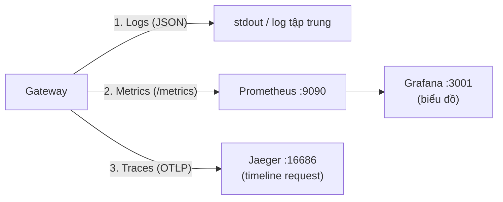

| Trụ cột | Câu hỏi nó trả lời | Công cụ |
|---|---|---|
| **Logs** | "Chuyện gì đã xảy ra?" (từng dòng sự kiện) | `logger.py` → JSON ra stdout |
| **Metrics** | "Bao nhiêu? Bao lâu?" (con số tổng hợp) | `metrics.py` → Prometheus → Grafana |
| **Traces** | "Request này đi qua đâu, chậm ở đâu?" | `tracing.py` → Jaeger |

**Demo observability:** chạy `scene6` trong `demo.py` bơm vài request fail, rồi:
- Grafana http://localhost:3001 → panel "Auth Failures" nhảy số.
- Jaeger http://localhost:16686 → mở trace, thấy `auth.method`, `auth.result`, `auth.latency_ms`.
- Prometheus http://localhost:9090/targets → gateway ở trạng thái `UP`.

---

## Phần 10 — Tự triển khai lại từ đầu

> Đây là "công thức nấu ăn" để bạn dựng lại đồ án này từ con số 0, theo thứ tự hợp lý.

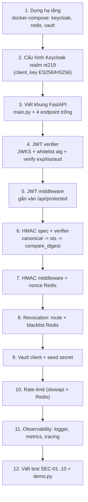

**Gợi ý từng bước:**
1. **Hạ tầng trước:** chỉ cần `docker-compose.yml` với keycloak + redis + vault chạy được đã.
2. **Keycloak:** tạo realm `nt219`, tạo client (`service-account` cho client_credentials,
   `web-app` cho PKCE), bật ký ES256. Export realm ra `idp-config/` để tự nạp lần sau.
3. **Khung FastAPI:** chỉ cần `/health` trả `{"status":"ok"}` chạy được là mốc đầu tiên.
4. **JWT verifier:** đây là phần học nhiều nhất — đọc lại Phần 7.2. Test bằng token thật từ
   Keycloak (lấy qua `curl` client_credentials trong README mục 4).
5–7. **Gắn bảo vệ:** mỗi lần thêm 1 lớp, viết ngay 1 test tấn công tương ứng để chắc chắn.
8–11. Bồi thêm revocation, vault, rate-limit, observability.
12. Cuối cùng gói lại bằng `demo.py` để present.

> 🔑 **Bí kíp học:** đừng cố hiểu hết 1 lúc. Hiểu **JWT verifier** + **HMAC verifier** thật
> kỹ (2 file `crypto/`) là đã nắm 70% "linh hồn" đồ án. Phần còn lại là "lắp ghép".

---

## Phần 11 — FAQ & mẹo

**Q: Vì sao `/api/protected` trả 401 dù token đúng?**
Token có thể đã hết hạn (Keycloak đặt hạn ngắn ~5 phút) → lấy lại token mới. Hoặc HS256 secret
giữa Gateway và Keycloak bị lệch.

**Q: HMAC trả `401 unknown_key`?**
`vault-seed` chưa chạy xong → secret chưa có trong Vault. Chạy lại `docker compose up -d vault-seed`.

**Q: Demo rate-limit ra 429 ngay từ đầu?**
Lần demo trước chưa reset cửa sổ → đợi ~60s.

**Q: Token để ở payload có an toàn không?**
Payload **ai cũng đọc được** (chỉ base64). Đừng để bí mật ở đó. Cái bảo vệ là **chữ ký**.

**Q: Vì sao tách `compute_signature` ra hàm riêng dùng chung client/server?**
Để chắc chắn 2 bên ký **cùng một chuỗi** → chữ ký khớp. Nếu mỗi bên tự viết, lệch 1 dấu cách
là sai hết.

**Q: `Exited 0` của vault-seed là lỗi à?**
Không! Đó là container "làm xong việc rồi thoát" — **đúng như mong đợi**.

---

## 📎 Phụ lục — Bản đồ file nhanh

| Muốn hiểu... | Đọc file |
|---|---|
| App khởi động & lắp ráp | `gateway/main.py` |
| Verify JWT (trái tim) | `gateway/crypto/jwt_verifier.py` |
| Ký/verify HMAC | `gateway/crypto/hmac_verifier.py` + `docs/hmac-signing-spec.md` |
| Middleware JWT / HMAC / rate-limit | `gateway/middleware/*.py` |
| Revoke token | `gateway/routes/auth.py` + `gateway/storage/revocation.py` |
| Đọc bí mật | `gateway/storage/vault_client.py` |
| Log / metric / trace | `gateway/observability/*.py` |
| Hạ tầng | `infra/docker-compose.yml` |
| Test tấn công | `tests/security/*.py` |
| Demo present | `scripts/demo.py`, `clients/test_hmac.py`, `clients/pkce_flow.py` |
| Đề bài gốc | `require/08_Secure API Gateway with Cryptographic Enforcement.md` |

---

*Tài liệu sinh tự động bằng cách phân tích trực tiếp mã nguồn (skill `understand` + `explain`).
Sơ đồ Mermaid render trực tiếp trên GitHub/VSCode (cài extension "Markdown Preview Mermaid Support").
Sơ đồ nguồn `.mmd` nằm trong thư mục [`so-do/`](so-do/) — có thể xuất PNG bằng `mmdc -i file.mmd -o file.png`.*
