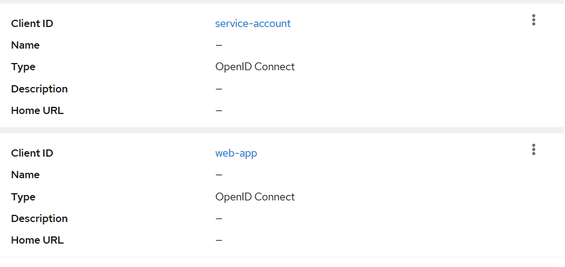
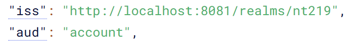

## Ngày 1: Khởi tạo Keycloak Local (A-D1)

### 1. Môi trường triển khai
- **Phiên bản:** Keycloak 24.0
- **Chế độ:** Development (`start-dev`)
- **Port:** `8080`

### 2. Lệnh khởi chạy
```bash
docker run -d --name keycloak \
  -p 8080:8080 \
  -e KEYCLOAK_ADMIN=admin \
  -e KEYCLOAK_ADMIN_PASSWORD=admin \
  quay.io/keycloak/keycloak:24.0 start-dev
```

## Ngày 2: Cấu hình Realm & Kiểm thử Token

### 1. Cấu hình Realm và Clients
- **Realm:** `nt219`
- **Clients đã tạo:**
  - `web-app`: Cấu hình cho Frontend SPA (Flow: Standard, PKCE: S256).
  - `service-account`: Cấu hình cho Backend (Flow: Client Credentials).
- **User:** `testuser` (Role: `user`)



### 2. Kiểm thử Token (Proof of Concept)
Thực hiện lấy token thông qua cURL (Client Credentials Flow):
```bash
curl -X POST http://localhost:8081/realms/nt219/protocol/openid-connect/token \
  -d "grant_type=client_credentials" \
  -d "client_id=service-account" \
  -d "client_secret=<SECRET_DA_LUU_TRONG_ENV>"
```
