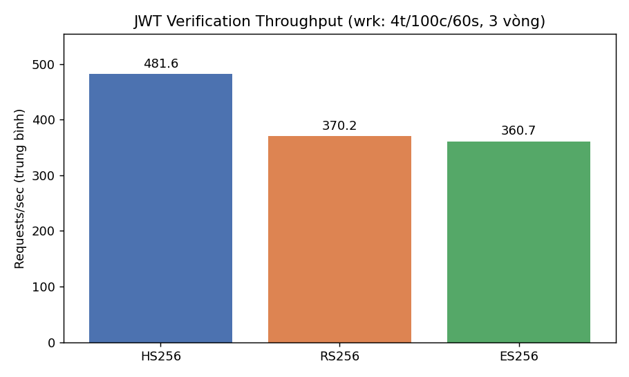
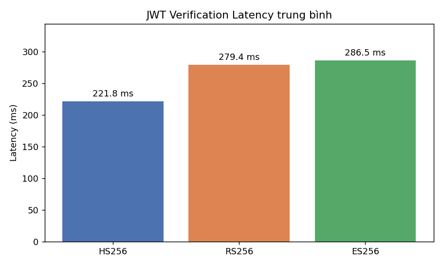
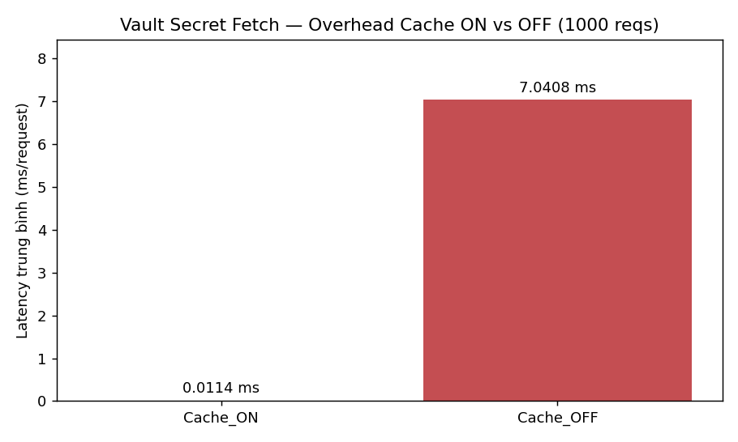

# BÁO CÁO — PHẦN SINH VIÊN C (Security & QA)

*(Mục 6, 7, 9, 10 + References để ghép vào `final_report.md`. Mục 3, 8 do A;
Mục 4, 5 do B.)*

---

## MỤC 6: THIẾT KẾ BẢO MẬT & PHÂN TÍCH MỐI ĐE DỌA STRIDE

### 6.1 Mô hình tin cậy (Trust Boundaries)

Hệ thống chia làm 3 vùng tin cậy: (1) **Untrusted** — client/Internet; (2)
**Gateway DMZ** — API Gateway thực thi cưỡng chế mật mã; (3) **Internal** —
Keycloak, Redis, Vault, backend chỉ truy cập qua mạng nội bộ Docker. Mọi request
từ vùng 1 vào vùng 3 bắt buộc đi qua Gateway và phải vượt qua xác thực JWT (ES256)
hoặc HMAC-SHA256.

### 6.2 Ma trận STRIDE (6 mối đe dọa × 6 tài sản)

| Threat \ Asset | Token (JWT) | Secret (HMAC/HS256) | Channel (HTTP) | Identity (Keycloak) | Log | Gateway |
|---|---|---|---|---|---|---|
| **S**poofing | Forge token (SEC-01) → chặn bởi chữ ký ES256/JWKS | Đoán shared secret (SEC-03) → dùng key ≥32B/Vault | Giả mạo client → TLS + (mở rộng) mTLS | Brute-force login → Keycloak lockout policy | Giả nguồn log → log tập trung append-only | Giả Gateway → image pin version, K8s RBAC |
| **T**ampering | Sửa payload/alg=none (SEC-02) → whitelist alg + verify sig | Sửa body request → HMAC body-hash (SEC-09) | MITM sửa gói tin → TLS toàn tuyến | Sửa realm config → admin API có auth | Sửa/xóa log → ship ra store ngoài | Sửa cấu hình runtime → container immutable |
| **R**epudiation | Chối đã gọi API → `jti` + log có `auth.user_id` | — | — | Chối đã cấp token → Keycloak audit log | Thiếu vết → structlog JSON + OTel trace | — |
| **I**nformation Disclosure | Lộ token trong log → KHÔNG log `Authorization` | Lộ secret trong code → Vault, `.gitignore` (SEC-01) | Nghe lén → TLS (checklist SEC-09) | Lộ PII claim → redact log | Log chứa secret → filter field nhạy cảm | Banner lộ version → ẩn `Server` header (SEC-10) |
| **D**enial of Service | Flood `/api/protected` → rate-limit slowapi | JWKS flood bằng kid lạ → cache JWKS 5'  | Flood TCP → rate-limit + (LB) | Flood Keycloak → Gateway cache, circuit-breaker | Log flood đầy đĩa → log rotation | Crash 1 pod → K8s 2 replica self-heal |
| **E**levation of Privilege | Đổi `roles` claim → chữ ký bảo vệ claim | Tái dùng key M2M cho user → tách key theo `key_id` | — | Lạm quyền admin → least-privilege client | — | Container root → `USER nonroot` (SEC-13) |

### 6.3 Biện pháp cưỡng chế chính

1. **JWT (ES256 + JWKS):** xác thực chữ ký bất đối xứng, whitelist `alg`,
   kiểm bắt buộc `exp/iat/iss/aud`, blacklist `jti` (revocation tức thời).
2. **HMAC-SHA256 (gateway-internal/v1):** canonical request + string-to-sign kiểu
   AWS SigV4, cửa sổ timestamp 300s, nonce dùng-một-lần (Redis TTL 600s),
   so sánh constant-time chống timing attack.
3. **Key management:** secret nạp từ HashiCorp Vault (cache 5'), xoay khóa Keycloak
   có grace period 1h, không hardcode.
4. **Hạ tầng:** rate-limit theo identity, structured logging ẩn field nhạy cảm,
   K8s 2 replica.

---

## MỤC 7: KIỂM THỬ AN NINH

### 7.1 Phương pháp

Kết hợp 3 lớp: (1) **Unit/Attack tests** tự động (`pytest`) mô phỏng 10 vector
SEC-01→SEC-10; (2) **Demo khai thác** brute-force HS256 yếu (SEC-03); (3) **DAST**
quét động bằng OWASP ZAP. Chi tiết kế hoạch: `tests/security_test_plan.md`.

### 7.2 Kết quả (xem `tests/results/security_test_results.md`)

| Nhóm | Kịch bản | Kết quả |
|------|----------|---------|
| JWT | SEC-01 forgery, SEC-02 alg=none, SEC-04 expired, SEC-05 aud, SEC-06 iss, SEC-10 revoked | 6/6 chặn (401) ✅ |
| HMAC | SEC-07 replay, SEC-08 clock-skew, SEC-09 tampering | 3/3 chặn (401) ✅ |
| Demo | SEC-03 weak HS256 brute force | crack `secret` 0.21 ms, `739` 13.97 ms ✅ |

**Tổng: 10/10 kịch bản đạt kỳ vọng.** Toàn bộ tự động hóa, chạy lại bằng:
`pytest tests/security -v --html=tests/results/report.html`.

### 7.3 DAST — OWASP ZAP

Quét baseline + active scan (`scripts/zap_scan.sh`, hướng dẫn `docs/zap-scan-guide.md`).
Tiêu chí: **không có finding Critical**. 401 trên endpoint protected/service là đúng
thiết kế. Các finding Low (security headers, server banner) đối chiếu checklist
hardening `docs/security-checklist.md`.

---

## MỤC 9: ĐÁNH GIÁ HIỆU NĂNG

### 9.1 Thiết lập

`wrk` 4 threads / 100 connections / 60s, lặp 3 vòng cho mỗi thuật toán JWT
(cache verify tắt). Vault đo 1000 lượt fetch secret, cache ON vs OFF. Locust mô
phỏng 200 user tải hỗn hợp (`benchmarks/scripts/locustfile.py`). Số liệu thô:
`benchmarks/results/*.csv`; biểu đồ: `benchmarks/plot_results.py`.

### 9.2 Throughput & Latency xác thực JWT

| Thuật toán | Throughput TB (RPS) | Latency TB (ms) | Latency Max (ms) |
|---|---|---|---|
| HS256 | **481.60** | 221.75 | 1290 |
| RS256 | 370.25 | 279.38 | 1173 |
| ES256 | 360.67 | 286.49 | 1440 |

**Nhận xét:** HS256 nhanh nhất (chỉ băm + XOR, O(N) trên thanh ghi CPU), cao hơn
ES256 ~33.5%. RS256 verify nhanh hơn ES256 nhờ số mũ công khai nhỏ ($e=65537$,
Hamming weight thấp), trong khi ECDSA phải nhân điểm vô hướng trên đường cong P-256.
Phân tích toán học chi tiết: báo cáo Mục 8 (A).

### 9.3 Overhead Vault (cache)

| Kịch bản | Latency TB (ms/req) |
|---|---|
| Cache ON | 0.0114 |
| Cache OFF | 7.0408 |

**Nhận xét:** cache TTL 5' giảm độ trễ fetch secret **~617 lần** (7.04 → 0.011 ms),
trả lời RQ2: overhead KMS được khử gần như hoàn toàn bằng caching, đúng giả thuyết.

### 9.4 Kết luận hiệu năng

Dù ES256 xếp cuối throughput, 360 RPS/node (~31 triệu req/ngày) vẫn dư cho phạm vi
đồ án. Đánh đổi ~2.6% throughput so với RS256 để lấy chữ ký 64B (so với 256B) và
kiến trúc Zero-Trust (JWKS, key rotation) là hợp lý — hệ thống chọn **ES256** cho
production, HS256 chỉ để đối chứng.

---

## MỤC 10: HẠN CHẾ & HƯỚNG PHÁT TRIỂN

### 10.1 Hạn chế

1. **TLS chưa bật mặc định:** dev chạy HTTP nội bộ Docker; production cần TLS/mTLS
   ở reverse proxy (đã ghi trong runbook & checklist SEC-09).
2. **Vault dev mode:** chạy in-memory, root token tĩnh — chưa có unseal/HA thật.
3. **Benchmark trên 1 máy:** wrk + Gateway cùng host nên latency max nhiễu bởi I/O
   OS; chưa đo trên cluster phân tán.
4. **Revocation phụ thuộc Redis đơn:** chưa replica/persistence; Redis sập thì
   blacklist mất (token vẫn hết hạn theo `exp`).
5. **ZAP scan thủ công:** chưa tích hợp DAST vào CI gate.

### 10.2 Hướng phát triển

1. **mTLS + certificate-bound tokens** (claim `cnf`), DPoP/PoP chống token theft.
2. **PQC-ready JWT:** thử nghiệm chữ ký hậu lượng tử (ML-DSA) và lộ trình di trú.
3. **Anomaly detection:** ML phát hiện lạm dụng token / pattern ký HMAC bất thường.
4. **Vault production:** auto-unseal (KMS), AppRole auth, dynamic secrets, HA.
5. **CI security gate:** đưa `pip-audit` + ZAP baseline thành điều kiện chặn merge.

---

## REFERENCES (IEEE)

[1] D. Hardt, "The OAuth 2.0 Authorization Framework," RFC 6749, IETF, Oct. 2012.
[2] M. Jones, J. Bradley, and N. Sakimura, "JSON Web Token (JWT)," RFC 7519, IETF, May 2015.
[3] M. Jones, "JSON Web Algorithms (JWA)," RFC 7518, IETF, May 2015.
[4] M. Jones, J. Bradley, and N. Sakimura, "JSON Web Signature (JWS)," RFC 7515, IETF, May 2015.
[5] H. Krawczyk, M. Bellare, and R. Canetti, "HMAC: Keyed-Hashing for Message Authentication," RFC 2104, IETF, Feb. 1997.
[6] N. Sakimura, J. Bradley, M. Jones, B. de Medeiros, and C. Mortimore, "OpenID Connect Core 1.0," OpenID Foundation, Nov. 2014.
[7] N. Sakimura, J. Bradley, and N. Agarwal, "Proof Key for Code Exchange by OAuth Public Clients," RFC 7636, IETF, Sep. 2015.
[8] NIST, "Recommendation for Key Management — Part 1," SP 800-57 Part 1 Rev. 5, May 2020.
[9] NIST, "Digital Signature Standard (DSS)," FIPS PUB 186-5, Feb. 2023.
[10] NIST, "Secure Hash Standard (SHS)," FIPS PUB 180-4, Aug. 2015.
[11] OWASP Foundation, "OWASP API Security Top 10 — 2023," 2023. [Online]. Available: https://owasp.org/API-Security/
[12] OWASP Foundation, "OWASP ZAP — Zed Attack Proxy Documentation," 2024. [Online]. Available: https://www.zaproxy.org/docs/
[13] The MITRE Corporation, "MITRE ATT&CK Framework," 2024. [Online]. Available: https://attack.mitre.org/
[14] Keycloak Community, "Keycloak Server Administration Guide," v24.0, Red Hat, 2024.
[15] HashiCorp, "Vault Documentation — KV Secrets Engine v2," 2024. [Online]. Available: https://developer.hashicorp.com/vault/docs
[16] Amazon Web Services, "Signing AWS API requests (Signature Version 4)," AWS General Reference, 2024.
[17] S. Ramírez, "FastAPI Documentation," 2024. [Online]. Available: https://fastapi.tiangolo.com/
[18] OpenTelemetry Authors, "OpenTelemetry Specification," CNCF, 2024. [Online]. Available: https://opentelemetry.io/docs/
[19] Prometheus Authors, "Prometheus Documentation," CNCF, 2024. [Online]. Available: https://prometheus.io/docs/
